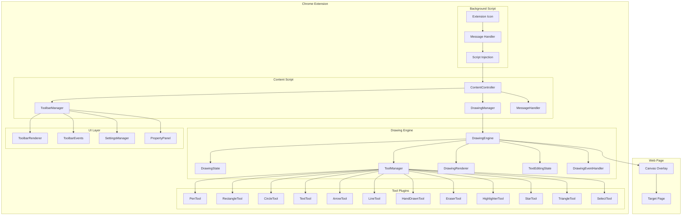
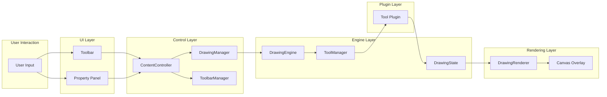
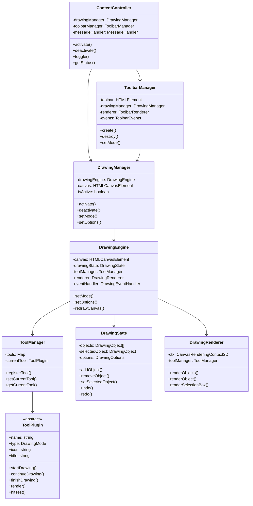
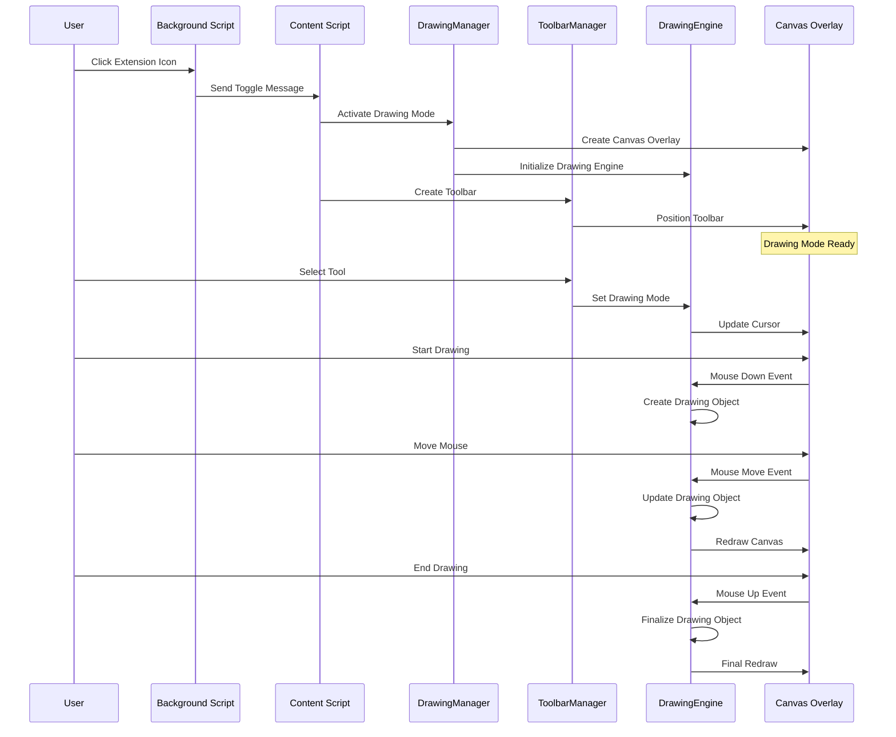
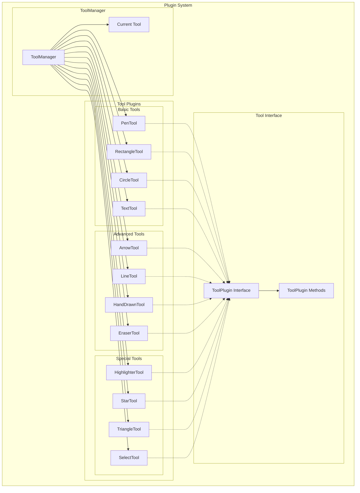
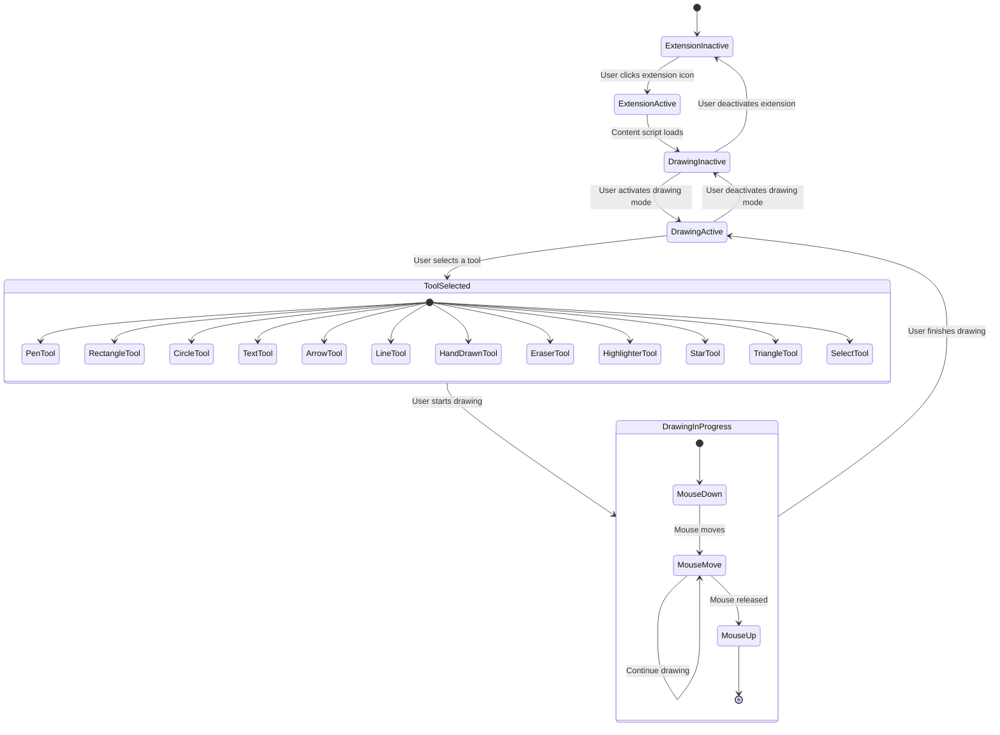
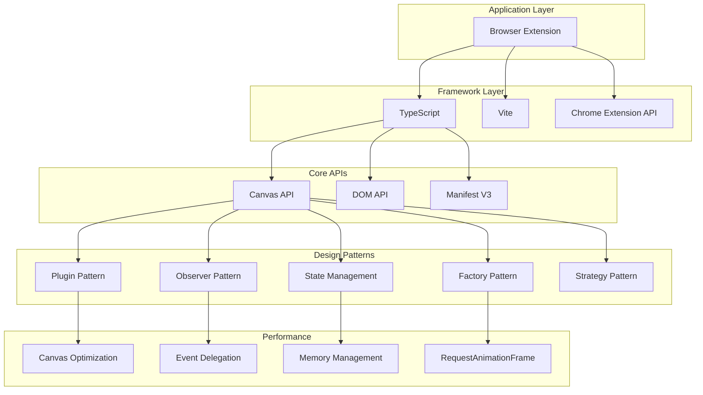

# 浏览器绘画扩展 - Mermaid架构图

## 整体系统架构

## 数据流向图

## 组件关系图

## 工作流程时序图

## 插件系统架构

## 状态管理架构

## 文件结构树

```mermaid
graph TD
    A[src/] --> B[background.ts]
    A --> C[content/]
    A --> D[lib/]

    C --> E[content.ts]
    C --> F[ContentController.ts]
    C --> G[core/]
    C --> H[ui/]

    G --> I[DrawingManager.ts]
    G --> J[MessageHandler.ts]

    H --> K[ToolbarManager.ts]
    H --> L[ToolbarRenderer.ts]
    H --> M[ToolbarEvents.ts]
    H --> N[SettingsManager.ts]

    D --> O[core/]
    D --> P[plugins/]
    D --> Q[state/]
    D --> R[events/]
    D --> S[rendering/]

    O --> T[DrawingEngine.ts]
    O --> U[types.ts]

    P --> V[ToolManager.ts]
    P --> W[ToolPlugin.ts]
    P --> X[PenTool.ts]
    P --> Y[RectangleTool.ts]
    P --> Z[CircleTool.ts]
    P --> AA[TextTool.ts]
    P --> BB[ArrowTool.ts]
    P --> CC[LineTool.ts]
    P --> DD[HandDrawnTool.ts]
    P --> EE[EraserTool.ts]
    P --> FF[HighlighterTool.ts]
    P --> GG[StarTool.ts]
    P --> HH[TriangleTool.ts]
    P --> II[SelectTool.ts]

    Q --> JJ[DrawingState.ts]
    Q --> KK[TextEditingState.ts]

    R --> LL[DrawingEventHandler.ts]

    S --> MM[DrawingRenderer.ts]
```

## 技术栈层次

这些Mermaid图表清晰地展示了浏览器绘画扩展的完整架构，包括：

1. **整体系统架构** - 展示了各层之间的关系
2. **数据流向图** - 显示了数据如何在组件间流动
3. **组件关系图** - 展示了类之间的依赖关系
4. **工作流程时序图** - 详细描述了用户交互的完整流程
5. **插件系统架构** - 展示了工具插件的组织结构
6. **状态管理架构** - 显示了系统的状态转换
7. **文件结构树** - 展示了项目的文件组织
8. **技术栈层次** - 展示了技术选型和设计模式

这个架构设计体现了现代Web扩展开发的最佳实践，具有高度的模块化、可扩展性和可维护性。
